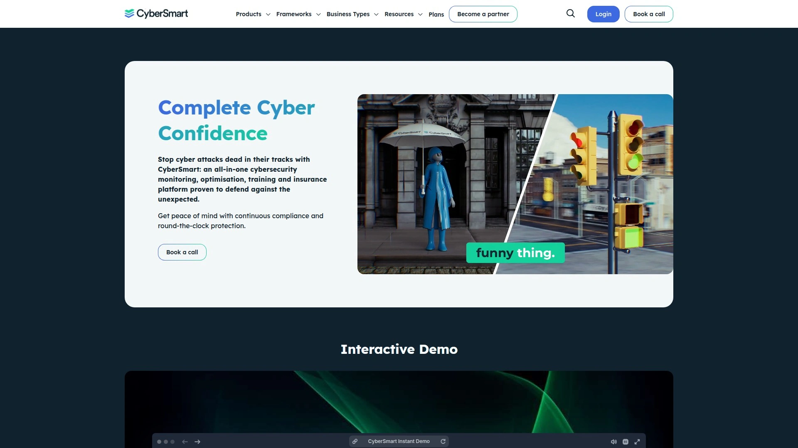
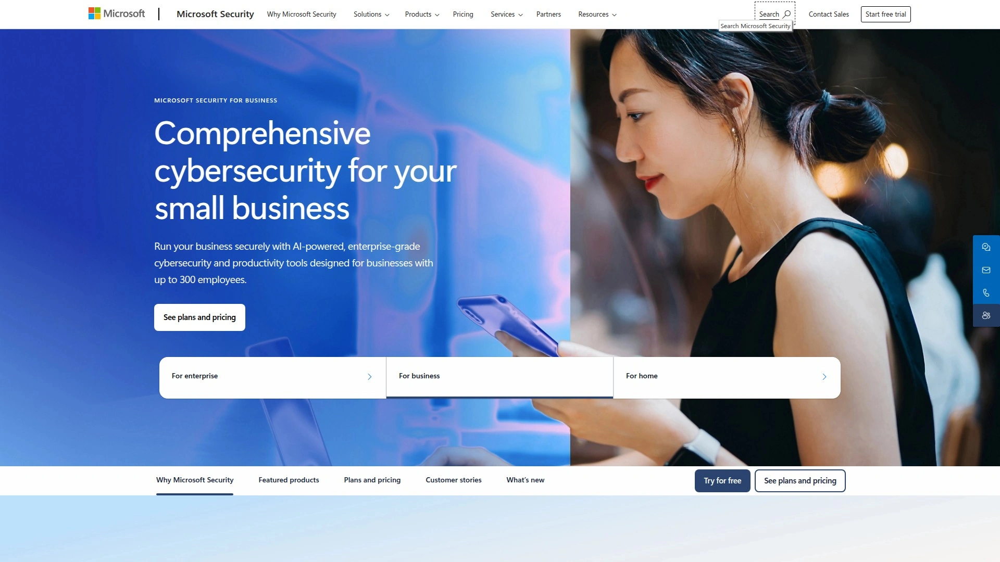
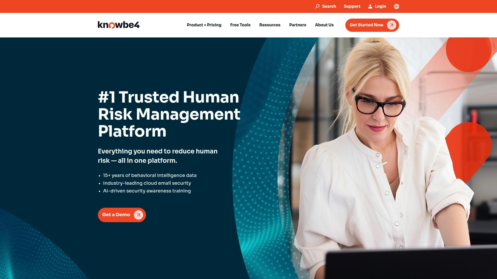
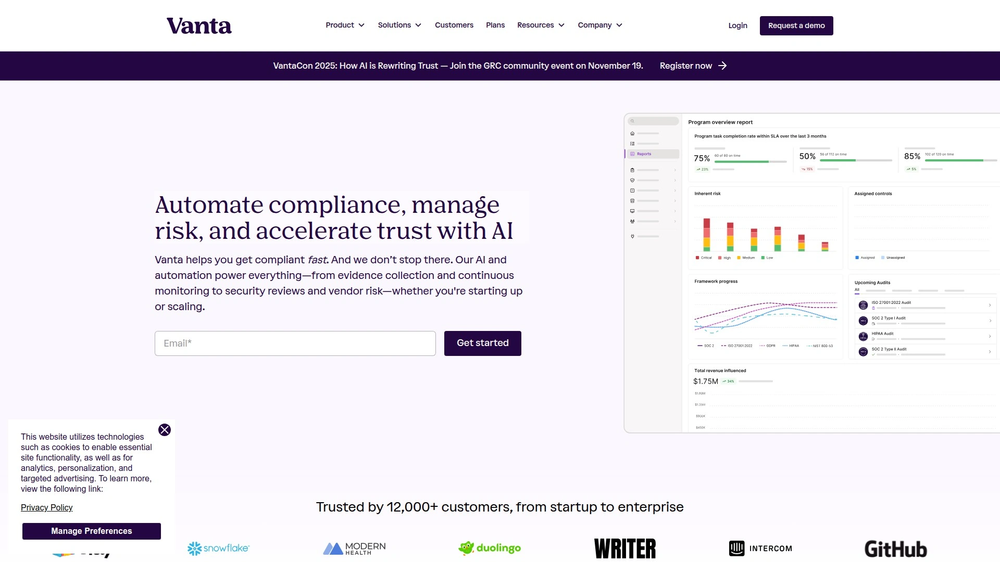
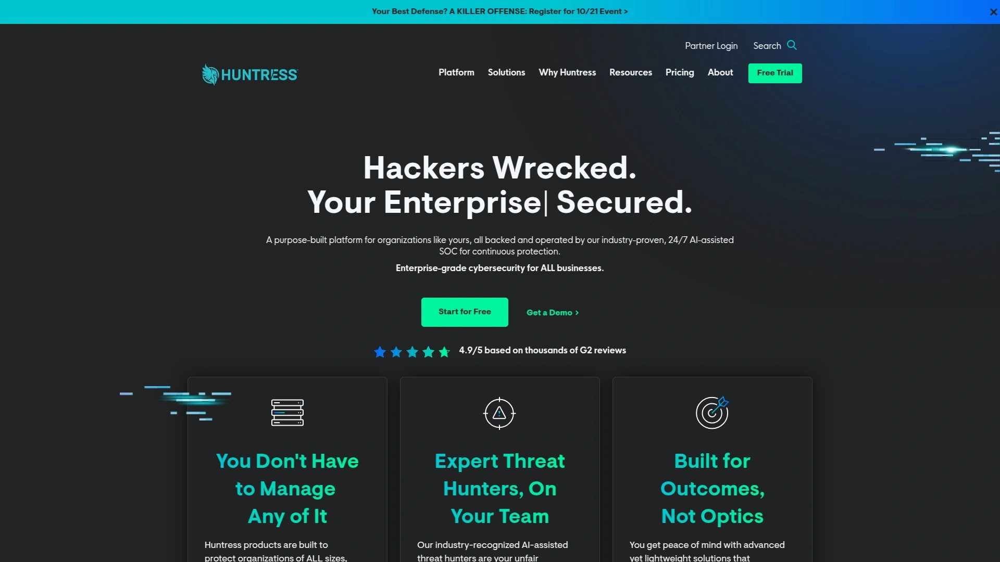
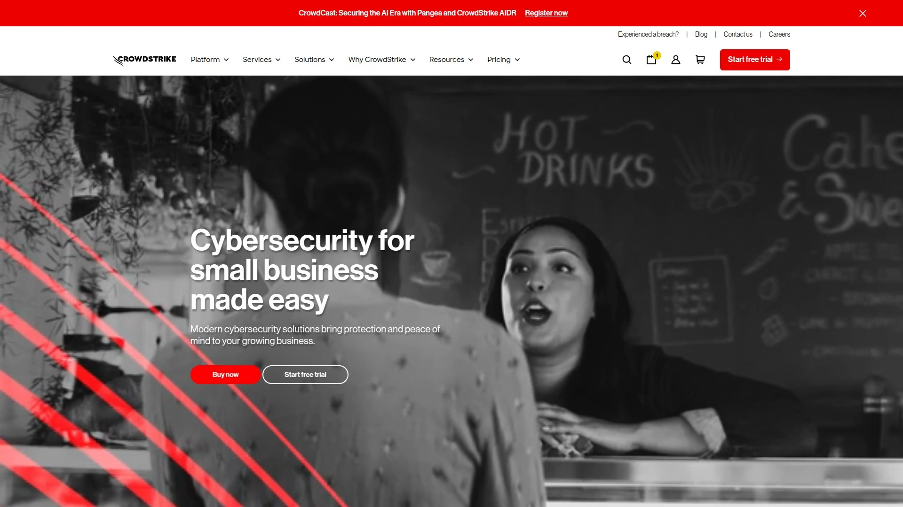
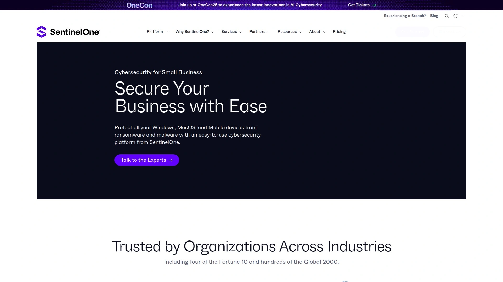
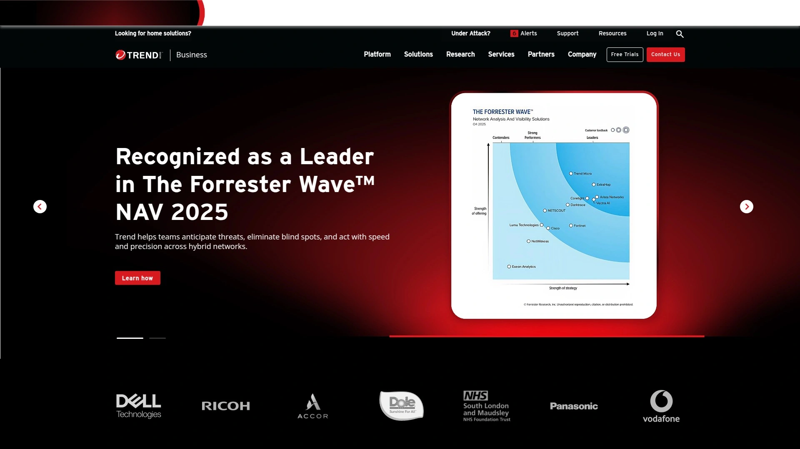
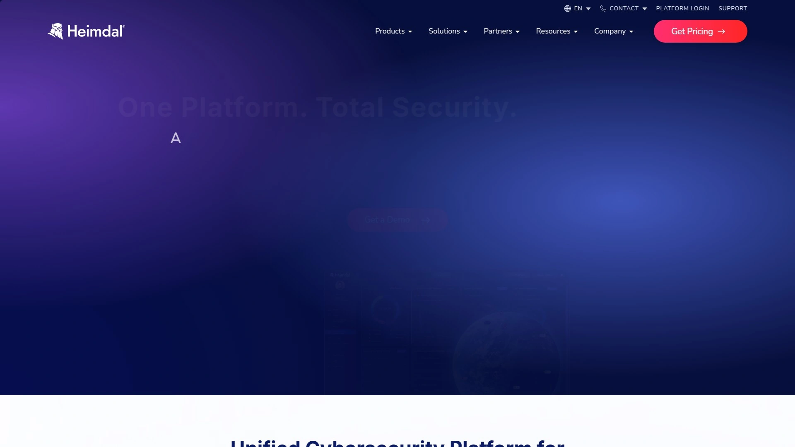
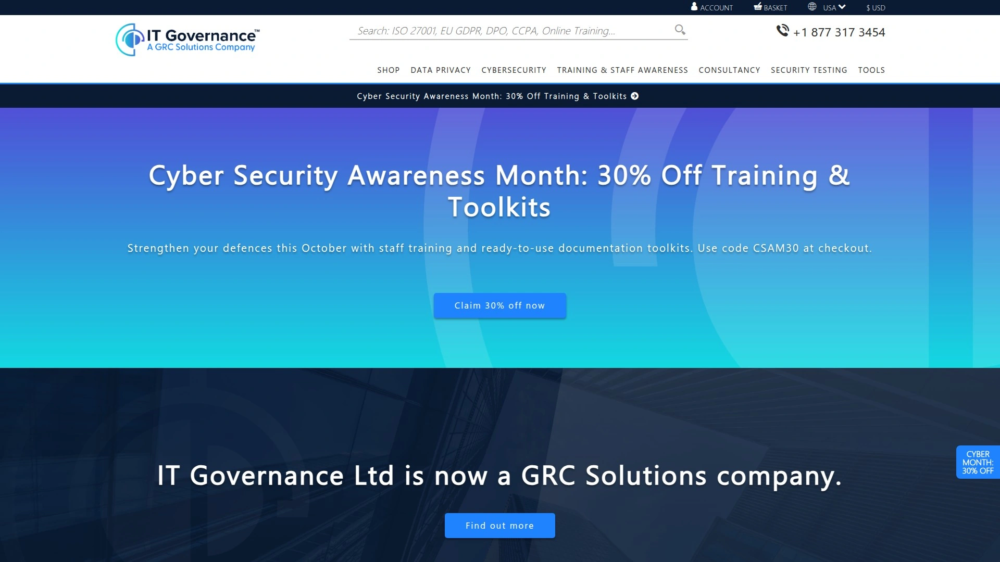

# 再也不用担心网络攻击了!推荐10款中小企业必备的安全神器

中小企业面对网络安全时总是很头疼——没有专业的安全团队、预算有限、不知道从哪入手、担心数据泄露和勒索软件、合规要求越来越严格。现在有一批专门为中小企业设计的网络安全平台,提供从漏洞扫描、安全培训、合规认证到保险保障的一站式解决方案。这份榜单整理了10个值得信赖的中小企业网络安全平台,覆盖端点防护、威胁检测、员工培训等核心需求,帮你用可承受的成本建立完整的安全防线。

***

## **[CyberSmart](https://cybersmart.co.uk)**

英国领先的中小企业一站式网络安全平台。

CyberSmart是一个专门为中小企业设计的全方位网络安全解决方案,整合了监控、优化、培训和保险四大核心功能,目前服务全球6000多家企业。平台的核心理念是"完整的网络信心",让不懂技术的企业主也能快速建立有效的安全防护。

**Cyber Essentials认证:** CyberSmart是英国政府支持的Cyber Essentials认证的官方提供商,帮助企业获得这个权威的网络安全认证。认证过程通过平台完成,从自我评估问卷到最终提交只需3小时左右。Cyber Essentials可以防御99.8%的常见网络攻击,是英国政府合同的必备资质。CyberSmart提供无限次的认证尝试和支持,确保通过率。

Active Protect是平台的主动防护产品,提供24/7持续监控、漏洞扫描、设备配置检查、策略管理、风险评估报告和安全意识培训。系统自动扫描所有端点和用户的安全状况,发现弱点后提供平台内的修复指导,告诉你具体该怎么操作。

Learn & Phish是员工培训模块,提供互动式的安全意识课程和真实的钓鱼邮件模拟演练。培训内容定制化,可以根据员工角色和风险等级分配不同的学习路径。实时报告让管理者看到每个员工的学习进度和钓鱼测试结果,针对性地强化薄弱环节。

**GDPR合规工具包:** Privacy Toolbox专门处理GDPR和数据隐私合规,提供主体访问请求管理、隐私政策生成器、专用工作流和评估工具。客户能向消费者证明自己的GDPR资质,建立数据处理的透明流程。

Patch Management支持350多个第三方应用的补丁管理,自动保持Windows和Mac系统及软件的安全更新。Vulnerability Manager提供高级漏洞检测和实时监控,生成易于执行的报告。CyberSmart的所有产品都配有英国本地的世界级支持团队,通过电话、邮件和WhatsApp提供帮助。

平台还包含最高10万英镑的网络保险覆盖,保护企业免受勒索软件等意外攻击的财务损失。用户评价显示"平台易用,从注册到认证只需3小时""支持团队响应快,能解决复杂问题""价格合理,适合中小企业预算"。

***

## **[Microsoft 365 Business Premium](https://www.microsoft.com/en-us/security/small-medium-business)**

微软为中小企业打造的企业级安全套件。

Microsoft 365 Business Premium是微软专门为300人以下企业设计的综合安全解决方案,结合了AI驱动的安全防护和生产力工具。平台把多个独立产品整合成一个简化且经济的套餐,提供多层防护体系。

Defender for Business是核心的端点防护组件,使用AI技术防御勒索软件和恶意软件,覆盖所有Windows、MacOS和移动设备。Defender for Office 365保护邮件和协作工具,阻止钓鱼攻击和恶意链接。Intune设备管理允许你设置安全策略,控制公司设备和员工自带设备的访问权限,保护敏感数据不被泄露或丢失。

**身份和访问管理:** Entra ID提供统一的身份管理和多因素认证,防止密码被盗后的未授权访问。所有员工通过一个身份系统安全访问业务应用和数据,无论在办公室还是远程工作。邮件加密、数据分类和标签功能帮助发现、标记和保护敏感信息,防止业务数据被意外或恶意分享。

Microsoft 365 Business Premium包含Word、Excel、PowerPoint等全套Office应用,让远程工作更高效安全。快速设置向导和新手入门支持帮助企业快速部署防护,不需要深厚的IT知识。安全专家可以通过文档、教程和社区资源获得额外帮助。

价格方面,Microsoft 365 Business Premium比单独购买各产品要实惠很多,提供"一站式"的成本效益。对于已经在使用Microsoft生态的企业,升级到Business Premium是最自然的选择,无需学习新平台,安全功能原生集成。适合需要企业级安全但没有专业IT团队的中小企业。

***

## **[KnowBe4](https://www.knowbe4.com)**

全球最大的安全意识培训和钓鱼模拟平台。

KnowBe4专注于解决网络安全中的"人"这个最薄弱环节,通过培训和测试提升员工的安全意识。平台提供业界最全面的培训内容库,涵盖钓鱼识别、社会工程、密码安全、数据保护等各个主题,内容本地化支持多种语言。

钓鱼模拟是KnowBe4的核心功能,系统自动发送模拟钓鱼邮件测试员工的警觉性。这些邮件基于真实世界的攻击模板设计,看起来非常真实。点击了钓鱼链接的员工会立即收到教育性的提示,解释刚才犯了什么错误以及如何识别这类攻击。

**AI驱动的个性化:** KnowBe4使用AI技术为每个员工提供个性化的培训推荐,根据他们当前的知识水平和钓鱼测试表现自动选择最合适的内容。ModStore(模块商店)会根据组织的整体钓鱼易感度推送定制化的培训材料,不断调整难度和重点。

企业级报告功能让管理者看到整个组织和每个部门的安全意识进展,识别需要额外培训的高风险员工。游戏化元素增加培训的趣味性,通过积分、排行榜、徽章等方式激励员工主动学习。统计数据显示,使用KnowBe4培训12个月后,企业的钓鱼易感度平均从30%以上降低到5%以下。

KnowBe4作为SaaS平台部署,不需要安装本地服务器。可以与Windows Active Directory集成,自动同步用户账户。虽然设置培训内容需要一定时间投入,但一旦配置完成,后续运行基本自动化。适合各规模的企业,特别是员工众多、需要持续安全意识强化的组织。

***

## **[Cynet](https://www.cynet.com)**

MSP和中小企业的托管式一体化安全平台。

Cynet提供的是All-in-One(一体化)安全平台,把通常需要多个产品才能实现的功能整合到单一解决方案里。这种整合减少了复杂性和成本,特别适合IT资源有限的中小企业。平台由24x7安全专家团队支持,等于为企业提供了外包的SOC(安全运营中心)。

端点检测与响应(EDR)持续监控和修复所有端点的高级恶意软件。端点保护(EPP)包含专有的下一代AI防病毒和设备控制,在威胁执行前就阻止它们。网络检测与响应(NDR)发现和应对在网络中横向移动的隐蔽威胁。用户行为分析(UBA)检测异常的用户活动,识别恶意攻击者或内部威胁。

**扩展检测与响应(XDR):** Cynet的XDR关联多源遥测数据,检测单一产品无法发现的隐蔽攻击和内部威胁。在2024年MITRE ATT&CK评估中,Cynet在没有任何配置改变的情况下实现了最大防护效果,表现出色。

Cynet还包含欺骗技术(Deception),部署诱饵文件、端点、用户和网络,引诱攻击者暴露自己的存在。SaaS安全态势管理(SSPM)和云安全态势管理(CSPM)识别和修复云应用和云环境中的安全风险。移动威胁防御(MTD)检测和阻止针对移动设备的威胁和恶意应用。

安全编排自动化与响应(SOAR)在整个环境中编排事件响应功能,自动化处理常见威胁。集中式日志管理(CLM)收集重要日志数据用于威胁搜寻和攻击调查。所有这些功能在一个平台上提供,管理界面统一,不需要在多个产品间切换。

Cynet提供14天免费试用,不需要信用卡。托管检测与响应(MDR)服务由远程SOC团队提供,等于企业拥有了24x7的安全专家监控。适合需要全面防护但没有内部安全团队的中小企业和为客户提供安全服务的MSP(托管服务提供商)。

---

## **[Vanta](https://www.vanta.com)**

自动化合规和安全态势管理平台。

Vanta专注于帮助企业实现和维持合规认证,支持SOC 2、HIPAA、ISO 27001、PCI DSS、GDPR等主要框架。对于需要通过合规审计来赢得客户信任或满足监管要求的企业,Vanta能大幅简化这个复杂且耗时的过程。

自动化是Vanta的核心优势。平台与300多个常用工具和服务集成,自动收集合规证据,持续监控安全状态。这意味着不需要手动收集文档、截图或日志,Vanta自动从你的云服务、身份系统、代码仓库等地方提取所需信息,生成审计报告。

**持续监控:** Vanta实时监控你的安全配置,当发现不符合合规要求的问题时立即警报。比如发现某个员工账户没有启用多因素认证、某个云资源配置不当暴露了风险、或者某个访问权限超出了应有范围。这种持续监控让企业始终保持审计就绪状态,而不是等到审计前夕才慌乱准备。

策略管理功能自动化策略的创建、维护和管理,确保文档的一致性和准确性。Vanta生成的策略模板符合各个框架的要求,只需要根据企业实际情况调整细节。全面的报告功能让企业能向审计师、监管机构和客户证明持续的合规状态,增强透明度和问责制。

Vanta的用户界面直观,即使不是合规专家也能理解和操作。平台的目标是让合规成为持续的业务流程,而不是偶尔发生的痛苦事件。对于初创公司、SaaS企业、金融科技、医疗科技等需要快速获得合规认证的行业,Vanta能缩短认证时间从几个月到几周。

Vanta不是安全防护产品,而是合规管理和安全态势可见性工具。需要与其他安全产品(如EDR、防火墙)配合使用,但它能确保你的整体安全架构满足认证要求并持续保持合规。

***

## **[Huntress](https://www.huntress.com)**

专为中小企业设计的托管安全平台。

Huntress的独特之处在于"托管"模式——平台不仅提供技术工具,还配有24x7分析师团队帮你调查威胁。这种人机结合的方式特别适合没有安全专家的中小企业,因为你不需要自己分析海量告警,Huntress的SOC团队会先确认威胁真实性,然后只把需要你采取行动的事项发给你。

轻量级代理安装在端点上收集遥测数据,检测持久化机制和可疑行为。勒索软件和立足点检测专门针对勒索软件攻击链的早期阶段,在加密和横向移动开始前就阻止攻击。事件响应指导提供操作手册,帮助隔离主机、移除持久化、恢复运营,并捕获证据用于事后分析。

**实用导向:** Huntress的事件报告简单易懂,清晰说明威胁的严重程度和下一步需要做什么。辅助修复功能提供一键执行的自动化修复步骤,让响应更快更简单。整个平台围绕"让非安全专业人士也能有效使用"这个理念设计,减少学习曲线。

策略和配置洞察帮助确保EDR覆盖率、代理健康状况和基线加固措施到位。Huntress生成的事件和工件可以映射到SOC 2、ISO 27001、HIPAA、PCI DSS等合规框架的控制要求,帮助满足审计需要。

部署快速是Huntress的另一个优势,简单的代理、清晰的仪表板和引导式操作缩短了从安装到见效的时间。因为平台专门为中小企业设计,定价合理,不会像企业级产品那样复杂和昂贵。Huntress适合精益IT团队,特别是MSP为客户部署安全防护的场景。

***

## **[CrowdStrike for Small Business](https://www.crowdstrike.com/en-us/solutions/small-business/)**

世界领先的EDR技术简化版。

CrowdStrike是网络安全领域的顶级品牌,其Falcon平台被大型企业广泛使用。Small Business版本把企业级技术简化,提供直观界面、简易安装和AI驱动的安全防护,让小企业也能享受到同样强大的保护。

云原生架构意味着不需要安装本地服务器,所有数据处理和威胁情报在云端完成。轻量级传感器安装在端点上,对性能影响极小。AI和机器学习引擎实时分析行为模式,识别和阻止零日威胁,不依赖传统的特征库匹配。

CrowdStrike的威胁情报来自全球数万亿次事件的数据,不断更新防御能力。当某个地方出现新型攻击时,所有使用Falcon平台的客户立即获得防护,不需要等待签名更新。这种集体智慧极大提升了防御效果。

**管理简单:** 统一的管理控制台让你在一个地方管理所有端点的安全状态,无论设备在哪里。自动化的响应操作可以隔离受感染设备、终止恶意进程、阻止通信,减少人工干预。

Small Business版本的定价比企业版实惠,考虑了小企业的预算限制。虽然比一些专门的SMB安全产品贵,但换来的是业界顶级的技术和品牌信誉。适合对安全有较高要求、愿意为高质量防护买单、计划未来扩展的成长型企业。

***

## **[SentinelOne](https://www.sentinelone.com/platform/small-business/)**

自主AI驱动的端点防护平台。

SentinelOne的核心技术是自主AI,能在没有人工干预的情况下检测、预防和响应威胁。这种"自动驾驶"式的安全方式特别适合缺乏安全专家的小企业——设置好之后,系统自动运行,自动处理绝大多数威胁。

平台保护Windows、MacOS和移动设备,覆盖所有常见端点类型。防御范围包括勒索软件、恶意软件、无文件攻击、漏洞利用等各类威胁。SentinelOne的优势是检测速度快,通常在毫秒级就能识别和阻止攻击,远快于传统防病毒软件。

**行为分析:** SentinelOne不仅看文件特征,更重视行为分析。即使是全新的、从未见过的恶意软件,只要它的行为符合攻击特征(比如尝试加密文件、修改系统配置、建立网络连接),SentinelOne也能识别和阻止。这种方法对零日攻击特别有效。

自动回滚功能是独特的保护层,当检测到勒索软件加密文件时,系统自动将受影响的文件恢复到攻击前的状态。这意味着即使攻击成功执行了一小段时间,数据也不会永久丢失。威胁搜寻工具允许主动在环境中寻找潜在威胁,而不是被动等待告警。

SentinelOne提供统一的管理平台Singularity,整合端点、云、身份等多个维度的安全数据。适合需要高性能防护、追求自动化、不想花大量时间管理安全工具的小企业。定价按端点数量计费,可以从小规模开始,随着业务增长扩展。

***

## **[Trend Micro](https://www.trendmicro.com)**

多层防护的老牌安全厂商。

Trend Micro是网络安全领域的资深品牌,提供全面的防护方案覆盖端点、网络和云环境。Smart Protection Suites在网关层面防止恶意URL、垃圾邮件和钓鱼邮件。XDR生态系统收集端点、邮件和云工作负载的信息,分析行为模式发现单层解决方案无法捕获的威胁。

Cloud One平台为容器和无服务器应用提供云原生安全,确保现代架构的保护。虚拟补丁(Virtual Patching)功能在企业能够应用正式补丁之前,先隐藏已知漏洞,防止被攻击者利用。这对于无法立即更新系统的企业特别有用。

Trend Micro的机器学习能力帮助检测和阻止复杂威胁,邮件安全过滤钓鱼和恶意邮件,网络防御监控和保护网络免受入侵。全面的套件意味着企业可以从单一供应商获得多层保护,简化管理和协调。

**品牌信誉:** Trend Micro在网络安全行业有长期历史,被全球企业信任。用户友好的界面降低了使用门槛。不过定价相对较高,高级功能需要付费升级。客户支持的评价褒贬不一,有用户反映响应速度不够快。适合追求综合套件、重视品牌声誉、需要覆盖多个防护层面的中小企业。

***

## **[Heimdal Security](https://heimdalsecurity.com)**

统一XDR平台和MSSP服务。

Heimdal提供"最广泛的统一网络安全解决方案",把各种安全工具整合到一个平台上。创始人Morten Kjaersgaard强调统一化的价值——集中控制和监控让即使是小型IT团队也能轻松管理,整体网络可见性提升了威胁检测和响应速度,所有工具无缝集成实时通信,防止和遏制潜在事件。

Heimdal的XDR平台包含端点安全、邮件安全、网络防御等组件,都在统一的界面下管理。如果企业完全没有IT团队或需要24x7监控,可以选择与MSSP(托管安全服务提供商)合作,外包安全管理。Heimdal与多家MSSP有合作关系,提供专业知识和可扩展的解决方案。

**针对SMB的优势:** 简化管理特别适合小型IT团队,集中式控制减少了在多个工具间切换的复杂性。更好的可见性让威胁无处藏身,无缝集成确保防护没有盲点。定价根据业务需求定制,提供免费演示和30天试用。

Heimdal的端点安全保护设备免受各类威胁,邮件安全过滤钓鱼和恶意邮件,网络防御监控和保护网络。机器学习能力增强了对复杂威胁的检测。适合需要统一平台、希望简化管理、考虑外包安全运营的中小企业。

***

## **[IT Governance USA](https://www.itgovernanceusa.com)**

合规咨询和认证服务提供商。

IT Governance USA提供的不是安全技术产品,而是帮助企业实现Cyber Essentials等认证的咨询和审计服务。对于需要通过官方认证但不知道如何准备的企业,IT Governance提供从评估、差距分析、整改指导到最终审计的全套服务。

Cyber Essentials认证包括自我评估问卷(SAQ)、外部漏洞扫描,Cyber Essentials Plus还包括额外的内部扫描和现场评估。IT Governance作为认证机构,可以执行这些审计并颁发证书。三步流程简化了认证过程:购买服务、完成评估、获得证书。

除了Cyber Essentials,IT Governance还支持ISO 27001、GDPR、PCI DSS等多种合规框架。提供培训课程、政策模板、工具包等资源,帮助企业建立和维持合规体系。适合需要正式认证、希望得到专业指导、追求外部验证的企业。

***

## 常见问题

**中小企业真的需要专业的网络安全平台吗?**

绝对需要。数据显示中小企业正成为网络攻击的主要目标,因为攻击者认为小企业防护薄弱且缺乏应对能力。勒索软件攻击可能让业务停摆数天甚至数周,数据泄露会导致客户流失和法律责任,监管罚款可能高达营业额的数个百分点。现代网络安全平台专门为中小企业设计,定价合理(通常每月每用户几美元到几十美元),部署简单(云端服务无需本地硬件),管理轻松(自动化和托管服务减少人工负担)。与潜在损失相比,这些投入是值得的保险。从基础做起,至少要有端点防护、邮件安全、员工培训这三个支柱,然后根据业务发展逐步完善。

**这些平台之间应该如何搭配使用?**

理想的安全架构是多层防御,但中小企业要平衡全面性和复杂性。推荐的核心组合:一个一体化平台(如CyberSmart、Cynet或Huntress)作为基础,覆盖端点防护、漏洞管理和基本监控;一个安全意识培训平台(如KnowBe4)强化人员这个薄弱环节;如果需要合规认证,加上合规管理工具(如Vanta)。这个组合能以可控的成本覆盖主要风险。避免购买功能重叠的产品,比如同时买多个EDR方案,不仅浪费预算还增加管理负担。如果预算非常有限,优先级应该是端点防护>邮件安全>员工培训>网络监控>合规工具。随着业务增长和风险暴露增加,再逐步添加更专业的工具。

**如何评估这些平台的实际效果?**

关键指标包括:威胁检测率(平台能识别多少真实攻击)、误报率(有多少正常活动被错误标记为威胁)、响应时间(从检测到处理的速度)、员工钓鱼易感度变化(培训平台的直接效果)、合规审计通过率(合规工具的效果)。大多数平台提供仪表板展示这些数据,关键是持续跟踪趋势而不是看绝对数字。比如钓鱼易感度从30%降到10%是明显进步,即使10%还不完美。利用平台的免费试用期(通常14-30天)亲自测试,看界面是否友好、部署是否顺利、告警是否有价值、支持是否及时。查看第三方评测(如MITRE ATT&CK评估、Gartner报告)了解技术能力。最重要的是,安全是持续过程而非一次性项目,选择能长期合作、不断更新防御能力的平台。

---

## 结语

这10个中小企业网络安全平台各有侧重,选择时根据你的行业、规模、预算和合规需求来定。如果你需要一个专门为中小企业设计、整合监控优化培训保险四大功能、提供Cyber Essentials认证、配有英国本地24/7支持团队、包含最高10万英镑保险覆盖的一站式解决方案,**[CyberSmart](https://cybersmart.co.uk)** 的完整生态和6000多家企业信任度特别适合希望快速建立全面防护、追求简单易用、需要官方认证背书的中小企业。记住,网络安全不是可选项而是生存必需,早投入早保护,总比遭受攻击后悔莫及要明智得多。
